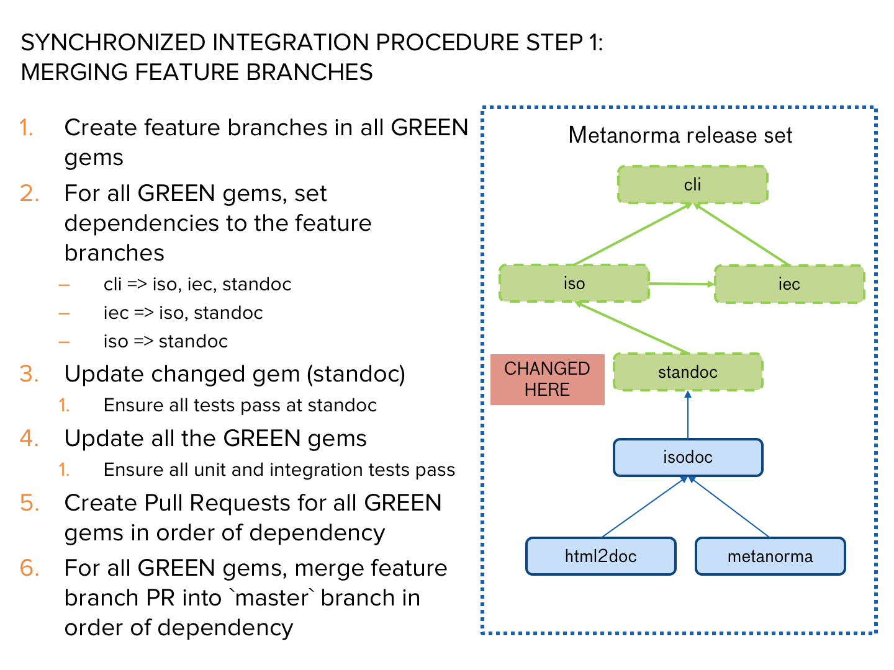

= Lapidist: synchronized gem releases

== Scope

Certain projects are dependent on the interoperability of a web of gems.
Changes to dependent gems, especially ones closer to the root, can cause
many of the downstream gems to need upgrading.

For example, a release of Metanorma spans over 50 gems. Changes to
an underlying gem like https://github.com/metanorma/metanorma[`metanorma`]
will require all downstream gems to re-run all tests.

This software is created to simplify the release procedure of dependent
gems. It provides methods to:

* Define this dependent web of gems
* Synchronized gem testing among this dependent web of gems
* Synchronized release of these gems (with version increments)

== Terms and definitions

leaf gem:: a gem that is no other software is dependent on
dependent gem:: a gem that other gems depend on
root gem:: a gem that does not depend on any other gem in the defined gem web
gem net:: a coherent set of gems that needs to interoperate and that requires synchronized releasing
caught gem:: gem under the release control of the releaser
release repository:: git repository or directory used for the releasing process

== Requirements

* https://hub.github.com/[hub] must be installed

== Features

. Integration testing
** all downstream gems can test against the work-in-progress upstream gems
** management of `Gemfile` and `gemspec` version control

. Release process
** automatic version bumps for gems
** synchronized pushes of feature branches across gems
** creation of PRs across gems
** synchronized release of gems

== Flow

=== Start release process

It all starts with the `start` subcommand.

NOTE: If you wish to run the Git version of `lapidist`, use `bundler` and a `Gemfile`; you will want to replace the command `lapidist` with `lapidist` for all steps below.

Go to the release repository:

[source,sh]
----
lapidist start -p .. -b 'feature/some-feature' -g isodoc,metanorma-iso,metanorma,metanorma-cli
----

`-p`:: path to `.gitmodules` file
`-b`:: branch name for feature, the same name will be used across all gems
`-g`:: comma-separated list of gems which will be included in feature (if missed default all gems included)

Finally this command will ask you to push changes to remote.

Under the hood this command does the following:

* use `bundler` to set local path to gems
* generate `Gemfile.devel` to keep CI "`green`"

=== Updating code and integrated testing

. Go to your release repository.
--
NOTE: If you have missed some gem, you can run `lapidist start ...` for it separately but keep branch name the same.
--

. Do the necessary work in the submodule'd gem in the gem net (within the release repository) i.e. `isodoc` or `metanorma-iso`.

. Run a script that performs tests on all the gems at once using the newly created feature branches:
--
[source,sh]
----
lapidist rake -p .. -b 'feature/some-feature'
----

NOTE: If you want Travis to test for you, push submodules of the release repository, and Travis will build for you.
--

. When all the gems pass locally, create PRs for `feature/some-feature` -> `master`

. Before merge finish feature with:
--
[source,sh]
----
lapidist finish -p .. -b 'feature/some-feature'
----
--

.. (alt) this will lead for short time breaks on CI till gems will be actually released

. Merge PRs by hand or by script (into `master` or a release branch)

=== Releasing

When all PRs merged, run a script to:

. Update ``gemspec``s dependencies version of recently released gems

. Run this to release passed gems:
--
[source,sh]
----
lapidist release -p .. -v patch -g isodoc,metanorma-iso,metanorma,metanorma-cli
----
--

. The `release` command will do:

.. version bump

.. commit bump

.. do tag

.. push tag to git

.. build gem

.. release gem to `rubygems.org`

Ideally, we want to update the root gems first, then the immediately dependent gems, and so forth towards the leaf gems to ensure that the builds always pass.

== Installation

[source,sh]
----
$ gem install lapidist
----

== Development

After checking out the repo, run `bin/setup` to install dependencies. Then, run `rake spec` to run the tests. You can also run `bin/console` for an interactive prompt that will allow you to experiment.

To install this gem onto your local machine, run `bundle exec rake install`. To release a new version, update the version number in `version.rb`, and then run `bundle exec rake release`, which will create a git tag for the version, push git commits and tags, and push the `.gem` file to https://rubygems.org[rubygems.org].

== Contributing

Bug reports and pull requests are welcome on GitHub at https://github.com/metanorma/lapidist. This project is intended to be a safe, welcoming space for collaboration, and contributors are expected to adhere to the http://contributor-covenant.org[Contributor Covenant] code of conduct.

== Code of Conduct

Everyone interacting in the Lapidist project's codebases, issue trackers, chat rooms and mailing lists is expected to follow the https://github.com/metanorma/lapidist/blob/master/CODE_OF_CONDUCT.md[code of conduct].

== Origin of the name

A "`lapidist`" is someone who cuts, polishes, or engraves gems. Geddit?

NOTE: The noun form of "`lapidary`" is now more popular than "`lapidist`" in this meaning, but the current usage also conflates the "`person`" ("`the lapidary`"), and the relation to gem processing ("`a lapidary engraving`").

== Release flow diagrams

